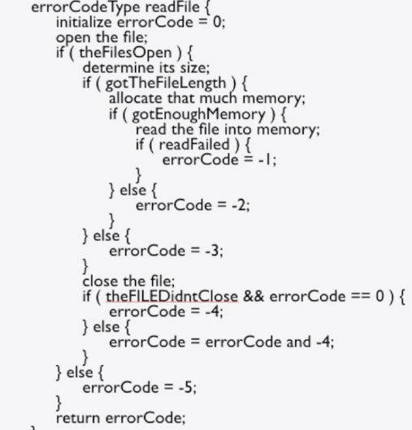
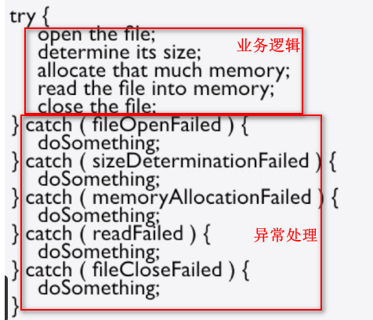

## 一、异常处理

#### 1. 异常

```java
try {
    // 可能产生异常的代码
} catch (Type1 id1) {
    // 处理异常Type1的代码
} catch (Type2 id2) {
    // 处理异常Type2的代码
} catch (Type3 id3) {
    // 处理异常Type3的代码
}
```

#### 2. 捉到了做什么

- 拿到异常对象之后
  - String getMessage();
  - String toString();
  - void printStackTrace();
- 但是肯定是回不去了，而具体的处理逻辑则取决于业务逻辑需要

---

## 二、异常机制

举例：如果要读文件，分成以下几步：

1. 打开文件；
2. 判断文件大小；
3. 分配足够的内存空间；
4. 把文件读入内存；
5. 关闭文件；

不好的代码示例：



好的处理方式示例：用上**异常机制**



异常机制最大的好处是 **清晰地分开了正常的业务逻辑代码与遇到情况时的处理代码**。

---

**异常声明**

- 如果我的函数可能抛出异常，就必须再函数头部加以声明

  ```java
  void f() throws TooBig, TooSmall, DivZero {
    // ...
  }
  ```

- 可以声明并不会真的抛出的异常

**什么能扔**

- 任何继承了Throwable类的对象
- Exception类继承了Throwable
  - throw new Exception();
  - throw new Exception("something");

---

小结：

如果你调用一个声明会抛出异常的函数，那么必须：

- 把函数的调用放在try块中，并设置catch来捕捉所有可能抛出的异常；或
- 声明自己会抛出无法处理的异常

异常声明遇到继承关系：

- 当覆盖一个函数的时候，子类不能声明抛出比父类的版本更多的异常
- 在子类的构造函数中，必须声明父类可能抛出的全部异常

---

1. 解释“当覆盖一个函数的时候，子类不能声明抛出比父类的版本更多的异常”：**作为成员函数不能增加更多的异常**。

```java
package mooc_java.deal_exception;

class Open_Exception extends Exception{}
class Close_Exception extends Open_Exception{}
class New_Exception extends Exception{}

public class ArrayIndex {
    public void fun() throws Open_Exception{}

    public static void main(String[] args) {
    }
}

class NewClass extends ArrayIndex{
    // 当覆盖一个函数的时候，子类不能声明抛出比父类的版本更多的异常
    // public void fun() throws Open_Exception, New_Exception{}
    public void fun() throws Open_Exception{}  

    public static void main(String[] args) {
        ArrayIndex p = new NewClass();
        try {
            p.fun();  // 如果还throws了New_Exception，这时p.fun()并不知道处理它
        } catch (Open_Exception e) {
            e.printStackTrace();
        }
    }
}
```

2. 解释“在子类的构造函数中，必须声明父类可能抛出的全部异常”：**作为构造函数可以增加更多的异常**。

```java
package mooc_java.deal_exception;

class Open_Exception extends Exception{}
class Close_Exception extends Open_Exception{}
class New_Exception extends Exception{}

public class ArrayIndex {
    public ArrayIndex() throws Open_Exception{}
    public void fun() throws Open_Exception{}

    public static void main(String[] args) {

    }
}

class NewClass extends ArrayIndex{
  	// 作为构造函数，
    public NewClass() throws Open_Exception, New_Exception{}
    public void fun(){}

    public static void main(String[] args) {
        try {
            ArrayIndex p = new NewClass();
            p.fun();
        // 在子类的构造函数中，必须声明父类可能抛出的全部异常
        } catch (Open_Exception | New_Exception e) {
            e.printStackTrace();
        }
    }
}
```

成员函数不能增加更多的异常，是因为我们可能把子类的对象当做父类来看待，这时如果通过父类的变量来调用子类的函数，我们需要处理好所有的异常；

而对于构造函数，在构造的时候，会自动调用父类的构造，父类的异常都声明了后就可以加自己的异常。

---

## 三、输入输出

**文件流**

- FileInputStream
- FileOutputStream
- 对文件作读写操作
- 实际工程中已经较少使用
  - 更常用的是以在内存数据或通信数据上建立的流，如数据库的二进制数据读写或网络端口通信
  - 具体的文件读写往往有更专业的类，比如配置文件和日志文件

**Data**

- DataInputStream
- DataOutputStream
- 用以读写二进制方式表达的基本数据类型的数据

```java
try {
		// FileOutputStream out = new FileOutputStream("a.dat");
    // 流的过滤器机制
    DataOutputStream out = new DataOutputStream(
            new BufferedOutputStream(
                    new FileOutputStream("a.dat")));
    int num = i;
    out.writeInt(num);
    out.close();

    DataInputStream in = new DataInputStream(
            new BufferedInputStream(
                    new FileInputStream("a.dat")));
    int content = in.readInt();
    System.out.println(content);
} catch (IOException e) {
    e.printStackTrace();
}
```


