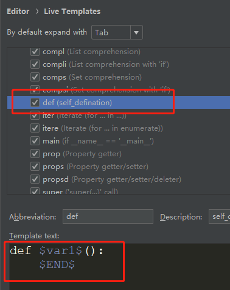
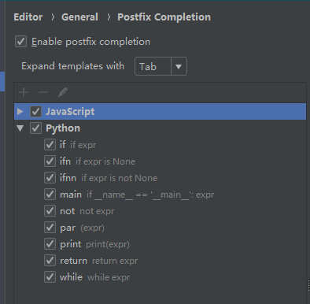
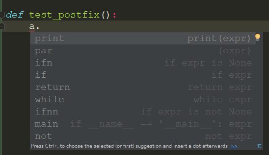

## pycharm中使用快捷键

#### 1. 常用快捷键

查看代码大纲：Ctrl + F12

查看脚本中的**结构图**：Ctrl + Shift + Alt + U   对于刚开始接触学习一个新框架很有用

类继承结构、方法调用层次：

- 查看类继承关系：Ctrl + H  
- 查看调用关系：Ctrl + Shift + H

例：类的继承关系


例：函数方法的调用关系


---

新建一个python脚本：Alt + Insert

复制当前行：Ctrl+C

复制当前行到下一行：Ctrl+D

剪切板：查看多次复制的内容：Ctrl + Shift +V

剪切当前行：Ctrl+X

删除当前行：Ctrl+Y

代码折叠/展开：Ctrl+ - /Ctrl++

---

将一行代码上下移动：Ctrl+Shift+上下键

定位到具体某一行：Crtl+G

定位到最后一次编辑的位置：Ctrl + Shift + Backspace

查找：

 - Find in current file：Ctrl + F
 - Find in path：Ctrl + Shift + F
 - Find in class：Ctrl + N
 - Find file with filename：Ctrl +Shift +N

整理格式化代码：Ctrl + Alt + L

提交代码：

 - commit：Ctrl + K
 - push：Ctrl + Shift +K

退出所有快捷键调出的界面：Esc

---

Alt + 1/2/3.... 打开界面的一些边框栏

find action 查找动作键：Ctrl+Shift+A    

help -> plugins添加/安装插件：Ctrl+Shift+A  -> plugins

recent files 最近使用的文件：Ctrl+E

bookmark 书签跳转：F11，Ctrl+ F11 选择num 添加书签num

Favorites：Ctrl + 2， 可以查看所有的书签 

navigate (以下快捷键按两下可以展示出非当前文件)

- 查找类：Ctrl+N
- 查找文件名：Ctrl+Shift+N
- 查找符号：Ctrl+Shift+Alt+N 

光标移至下一个单词末尾（move caret to next word）：Ctrl+左右键

选中下一个单词或多个单词：Ctrl+Shift+左右键

大小写切换：光标移至所要切换的单词处，Ctrl+Shift+U

选择所有上下行的相似处（select all occurrences ）：Ctrl+Alt+Shift+J

---

#### 2. 模板（live templates）:

自定义模板：比如创建一个函数模板时，以后只要敲def后直接输入函数名和函数主体了，经常使用的也有创建类。



---

#### 3. postfix：

pycharm提供的有 if, ifn, ifnn, main, not, par, print, return, while.





---

#### 4. Alt+Enter

1. 对未创建的函数进行自动创建；

   ```python
   a = 1  # step1：先定义一个变量a
   
   def func(a):   # 这是step2后自动创建的
       pass
   
   func(a)  # step2：写一个func(a), 然后发现没有定义func函数，于是在func位置按Alt+Enter，pycharm会在这行func(a)的上面自动创建一个func函数
   ```

2. 导包

3. 不知道干嘛时，在代码上按下Alt+Enter，会有相关提示操作，有惊喜。

   ```python
   # 例如我定义了一个字符串b，如果后期优化代码时需要给提示该b为字符串
   b = "bb"   # Alt+Enter
   b: str = "bb"  # Alt+Enter后的结果
   ```

   

---

#### 5. 重构（refactor）：

1. 重构变量：Shift+F6

2. 重构函数名：Ctrl+F6；如果需要添加入参，可以直接添加后Alt+Enter

3. 抽取

   1. 抽取变量：Ctrl+Alt+V

      有时候代码中反复使用某个长字符串或者其他，需要简化为更易读易理解的变量。

      ```python
      # 抽取前
      def refactor_test():
          print("refactor")
          print("refactor")
          print("refactor")
          print("refactor")
          
      # 抽取后
      def refactor_test():
          test_factor = "refactor"
          print(test_factor)
          print(test_factor)
          print(test_factor)
          print(test_factor)
      # 在非函数体中同样适用
      ```

   2. 抽取静态变量：Ctrl+Alt+C

      ```python
      # 抽取前
      def refactor_test():
          print("refactor")
          print("refactor")
          print("refactor")
          print("refactor")
      
      # 抽取后
      REFACTOR = "refactor"
      def refactor_test():
          print(REFACTOR)
          print(REFACTOR)
          print(REFACTOR)
          print(REFACTOR)
      ```

   3. 抽取成员变量：Ctrl+Alt+F

      ```python
      # 抽取前
      class TestRefactor(object):
          def test_factor(self):
              print("test_factor")
              print("test_factor")
              print("test_factor")
              print("test_factor")
      
      # 抽取后
      class TestRefactor(object):
          def test_factor(self):
              self.test_factor = "test_factor"
              print(self.test_factor)
              print(self.test_factor)
              print(self.test_factor)
              print(self.test_factor)	
      ```

   4. 抽取方法参数：Ctrl+Alt+P

      有时候函数内部代码复杂，为了使得逻辑和数据分离开。

      ```python
      # 抽取修改前
      class TestRefactor():
          origin_name = "origin"
          def test_factor(self, add_name):
              refactor_name = self.origin_name + add_name
              return refactor_name
          def get_refactor(self):
              return self.test_factor("myname")
      
      # 抽取修改后
      class TestRefactor():
          origin_name = "origin"
          def test_factor(self, add_name, origin_name):
              refactor_name = origin_name + add_name
              return refactor_name
          def get_refactor(self):
              return self.test_factor("myname",origin_name=self.origin_name)
      
      ```

   5. 抽取函数：Ctrl+Alt+M

      有时候一个函数内部逻辑复杂，业务较多，可以将部分分开抽取出来。

      ```python
      # 抽取前
      def test_refactor():
          print("step1 get something")
          print("step1 get something")
          print("step2 put something")
          print("step2 put something")
          print("step3 check something")
          print("step3 check something")
          
      # 抽取后
      def test_refactor():
          get_something()
          put_something()
          check_something()
      
      def check_something():
          print("step3 check something")
          print("step3 check something")
      
      def put_something():
          print("step2 put something")
          print("step2 put something")
      
      def get_something():
          print("step1 get something")
          print("step1 get something")
      ```


---

#### 6. Debug快捷键

添加/删除断点（toggle line breakpoint）：Ctrl + F8

debug：Shift + F9

禁止所有断点：mute breakpoint，一般后续配合着F9

查看所有断点：Ctrl + Shift + F8

条件断点：在当前断点行按住Ctrl + Shift + F8

step over（**F8**）：在单步执行时，在函数内遇到子函数时不会进入子函数内单步执行，而是将子函数整个执行完再停止，也就是把子函数整个作为一步。在不存在子函数的情况下是和step into效果一样的。简单的说就是，程序代码越过子函数，但子函数会执行，且不进入。

step into（**F7**）：在单步执行时，遇到子函数就进入并且继续单步执行，有的会跳到源代码里面去执行。

step into my code（Alt+Shift+F7快捷键）：在单步执行时，遇到子函数就进入并且继续单步执行，不会进入到源码中。

step out（**Shift+F8**）：假如进入了一个函数体中，跳出当前函数体内，返回到调用此函数的地方。

run to cursor（**Alt + F9**）: 如果需要略过中间一些代码块，跳转到光标点击的所在行。

Resume program(**F9**)：继续恢复程序，直接运行到下一断点处，若后面没有断点了就运行所有后结束。

SetValue（**F2**）:在调试窗口可以点击某变量按F2改变当前的值来进行调试。

Evaluate Expression(**Alt+F8**)：打开强大的计算表达式窗口。

以上就是最常用的功能，一般操作步骤就是，设置好断点，debug运行，然后 F8 单步调试，遇到想进入的函数 F7 进去，想出来在 shift + F8，跳过不想看的地方，直接设置下一个断点，然后 F9 过去

---

#### 7. git集成

寻找修改轨迹

- Ctrl +Shift +A：annotate 查询
- 撤销某处（一般在版本控制基础上）的修改：Ctrl + Alt + Z
- 撤销文件所有修改（Revert Changes）：在该文件中没有改动处按下Ctrl + Alt + Z
- local history：当项目没有版本控制时用比较方便，可以put label

