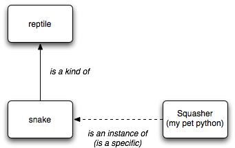
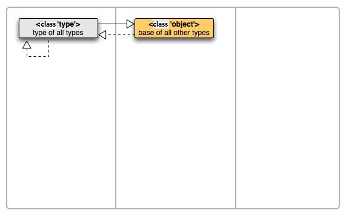
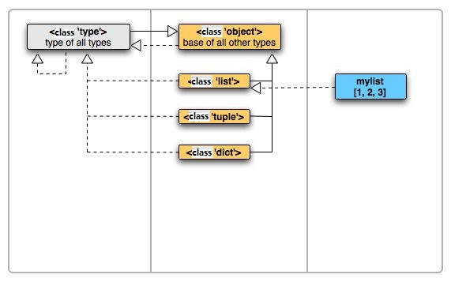
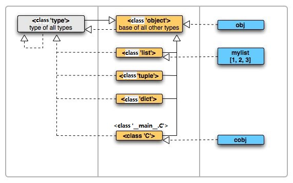

**Rome was not built in one day， coding will not advance vigorously with one effort.**

# 内部机制

除了掌握Python本身的语法以及使用外，对其内部机制的探索可以更深入理解和掌握语言本身蕴含的思想和理念。

## 理解built-ln objects

Python中一切皆对象：字符是对象、列表是对象、内建类型 (built-ln type）也是对象；用户定义的类型是对象，object是对象，type也是对象。新式类中，object是所有内建类型的基类，所以用户定义的类可以继承自object可以继承自内建类型。

object 和 type的关系很像鸡和蛋的关系，先有object还是先有type没法说，obejct和type是共生的关系，必须同时出现的。

---

在面向对象体系里面，存在两种关系：

- 父子关系，即继承关系，表现为子类继承于父类，如『蛇』类继承自『爬行动物』类，我们说『蛇是一种爬行动物』，英文说『snake is a kind of reptile』。**在python里要查看一个类型的父类，可使用它的`__bases__`属性**。
- 类型实例关系，表现为某个类型的实例化，例如『萌萌是一条蛇』，英文说『萌萌 is an instance of snake』。**在python里要查看一个实例的类型，可以使用它的`__class__`属性，或者使用type()函数**。

这两种关系使用下面这张图简单示意，继承关系使用实线从子到父连接，类型实例关系使用虚线从实例到类型连接：



我们将使用一块白板来描述一下Python里面对象的关系，白板划分成三列。

---

 先来看看type和object： 它们都是type的一个实例，表示它们都是类型对象。 

```
>>> object
<class 'object'>
>>> type
<class 'type'>

>>> type(object)
<class 'type'>
>>> type(type)
<class 'type'>
```

 在Python的世界中，object是父子关系的顶端，所有的数据类型的父类都是它；type是类型实例关系的顶端，所有对象都是它的实例的。它们两个的关系可以这样描述：

object是一个type，object is and instance of type。即**object是type的一个实例**。isinstance(object, type) == True

```
>>> object.__class__
<class 'type'>
>>> object.__bases__   # object 无父类，它是滴继承关系的顶端
()
```

 type是一种object， type is kind of object。即type是object的子类。 

```
>>> type.__class__   # type的类型是自己
<class 'type'>
>>> type.__bases__ 
(<class 'object'>,)
```

**在python里：**

**要查看一个类型的父类，可使用它的`__bases__`属性；**

**要查看一个实例的类型，可使用它的`__class__`属性，或者使用type()函数**

此时，白板上对象的关系如下图：



 引入list, dict, tuple 这些内置数据类型来看看： 
它们的父类都是object，类型都是type。 

```python
def test(obj):
    print(type(obj))          # <class 'type'>
    print(obj.__class__)			# <class 'type'>
    print(obj.__bases__)			# (<class 'object'>,)
    print(isinstance(obj,object))	# True
    print(isinstance(obj,type))	  # True
test(list)
test(dict)
test(tuple)
```

实例化一个list后的结果：
mylist = [1, 2, 3] 它的类型是list，没有父类。

```python
def test(obj):
    print(type(obj))          # <class 'list'>
    print(obj.__class__)			# <class 'list'>
    print(obj.__bases__)			# AttributeError: 'list' object has no attribute '__bases__'
    print(isinstance(obj,object))	# True
    print(isinstance(obj,type))	  # False
    
mylist = [1, 2, 3]
test(mylist)
```

把它们加到白板上去：



 白板上的虚线表示源是目标的实例，实线表示源是目标的子类。
即: 左边的是右边的类型，上面的是下面的父亲。
虚线是跨列产生关系，而实线只能在一列内产生关系。除了type和object两者外。 

---

自定义一个类及实例化它的时候，和上面的对象们又是什么关系呢？ 

```python
class C():
    pass
    
c = C()

def test(obj):
    print(type(obj))          # <class 'type'>
    print(obj.__class__)			# <class 'type'>
    print(obj.__bases__)			# (<class 'object'>,)
    print(isinstance(obj,object))	# True
    print(isinstance(obj,type))	  # True
test(C)

def test(obj):
    print(type(obj))          # <class '__main__.C'>
    print(obj.__class__)			# <class '__main__.C'>
    print(obj.__bases__)			# AttributeError: 'C' object has no attribute '__bases__'  实例化的C类对象也是没有父类的属性的。
    print(isinstance(obj,object))	# True
    print(isinstance(obj,type))	  # False
test(c)
```

再更新一下白板：



白板上的第一列，目前只有type，我们先把这列的东西叫Type。
白板上的第二列，它们既是第三列的类型，又是第一列的实例，我们把这列的对象叫TypeObject。
白板上的第三列，它们是第二列类型的实例，而没有父类（`__bases__`）的，我们把它们叫Instance。

---

 想要在第一列增加一个，要怎么做？要属于第一列的，必须是type的子类，那么我们只需要继承type来定义类就可以了： 

```python
class M(type):
    pass

print(M.__bases__)  # (<class 'type'>,)
print(M.__class__)	# <class 'type'>
```

 M类的类型和父类都是type。这个时候，我们可以把它归到第一列去。那么，要怎么样实例化M类型呢？实例化后它应该出现在那个列? 由于刚刚创建的是一个**元类（MetaClass）**！即类的类。如果你要实例化一个元类，那还是得定义一个类： 

```python
class TM(object, metaclass=M): # 造一个M是TM的metaclass，指定元类
    pass

print(TM.__class__)  # <class '__main__.M'>  # 这个类不再是type类型，而是M类型的。
print(TM.__bases__)	 # (<class 'object'>,)
```

总结一下：
第一列，元类列，type是所有元类的父亲。我们可以通过继承type来创建元类。
第二列，TypeObject列，也称类列，object是所有类的父亲，大部份我们直接使用的数据类型都存在这个列的。
第三列，实例列，实例是对象关系链的末端，不能再被子类化和实例化。

补充一张知乎上的图：

 


---

## metaclass

什么是元类：

- 元类是关于类的类，是类的模板
- 元类是用来控制如何创建类，正如类是创建对象的模板一样
- 元类的实例为类，正如类的实例为对象

类也是对象，一切皆对象。当使用关键字class时，Python解释器在执行时会创建一个对象（这里的对象是指类，而非类的对象）

```python
def dynamic_class(name):
    if name == 'A':
        class A(object):
            pass
        return A
    elif name == 'B':
        class B(object):
            pass
        return B


MyClass = dynamic_class("A")
print(MyClass())  # <__main__.dynamic_class.<locals>.A object at 0x000001EB066CA518>
print(MyClass)  # <class '__main__.dynamic_class.<locals>.A'>
print(MyClass.__class__)  # <class 'type'>
print(MyClass().__class__)  # <class '__main__.dynamic_class.<locals>.A'>
print(MyClass.__bases__)  # (<class 'object'>,)
```

MyClass的类型是type，MyClass()的类型是  `<class '__main__.dynamic_class.<locals>.A'>`。

type还可以这样使用：

```
type(类名, 父类的元组（针对继承的情况，可以为空）, 包含属性的字典（名称和值）)
```

```python
A = type('A', (object,), {'var_attr':1})

A.__class__
Out[1]: type
A.__bases__
Out[2]: (object,)
A.var_attr
Out[3]: 1
  
  
class B(A):
    pass
B
Out[4]: __main__.B
B.__class__
Out[5]: type
B.__bases__
Out[6]: (__main__.A,)
B.var_attr
Out[7]: 1
```

type通过接受类的描述作为参数返回一个对象，这个对象可以被继承， 属性能够被访问，它实际是一个类，其创建由type控制，有type创建的对象的`__class__`类型为type。type是Python的一个内建元类，用来指导类的生成。除了用内建元类type，用户也可以通过继承type来自定义元类。

---

## `__init__()`不是构造方法

```python
class A(object):
    def __new__(cls, *args, **kwargs):
        print(cls, args, kwargs)
        instance = object.__new__(cls)
        print(instance)
        # return instance
    def __init__(self, *args, **kwargs):
        self.a, self.b = args
        print(self.a, self.b)

a1 = A(1,2,var=3)
print(a1.a)
print(a1.b)
```

```
<class '__main__.A'> (1, 2) {'var': 3}
Traceback (most recent call last):
<__main__.A object at 0x000002147F2BC320>
  File "D:/keeplearning/myLearning/python/book1/test.py", line 13, in <module>
    print(a1.a)
AttributeError: 'NoneType' object has no attribute 'a'
```

`__init__()`并不是真正意义上的构造方法，`__init__()`方法所做的工作是在类的对象创建好后进行变量的初始化。 **`__new__()`方法才会真正的创建实例，是类的构造方法**。

这两个方法都是object 类中默认的方法， 继承自object的新式类，如果不覆盖这两个方法将会默认调用object中对应的方法。

上面的程序抛出异常时因为`__new__()`方法中并没有显式返回对象，因此a1为None。将上面代码中的注释取消就可以返回显式对象了。

关于`__new__()`和`__init__()`方法的定义：

- `object.__new__(cls[,args...])` ：cls代表类，args为参数列表

- `object.__init__(self[,args...])` ： self代表实例对象，args为参数列表

- `__new__()` 是静态方法，`__init__()` 是实例方法

- `__new__()` 方法一般需要返回类的对象，当返回类的对象时将会自动调用`__init__()`方法进行初始化，如果没有对象返回，则`__init__()`方法不会被调用；`__init__()`方法不需要显式返回，默认为None，强行写return会抛出TypeError

- 当需要控制实例创建的时候可使用`__new__()` 方法，而控制实例初始化的时候使用`__init__()`方法

- 一般情况下，不需要覆盖`__new__()`方法，但当子类继承自不可变类型，如str、int、tuple时，往往需要覆盖该方法

- 当需要覆盖`__new__()`和`__init__()` 时，必须使得两个方法的参数保持一致，否则导致异常

  ```python
  class B(object):
      def __new__(cls, a, b):
          # return object.__new__(cls)
          return super(B,cls).__new__(cls)
      def __init__(self, a, b): 
          self.a = a
          self.b = b
  b = B(1,2)
  # 如果new和init方法的入参不一致，pycharm中会有检查提示：
  # This inspection checks mutual compatibility of __new__ and __init__ signatures
  # 但是如果使用 *args 或者 **kwargs就避免此问题的出现。
  ```


---

## 名字查找机制

Python中所有变量名都是赋值的时候生成的，而对任何变量名的创建、查找或者改变都会在命名空间（namespace）中进行。变量名所在的命名空间直接决定了其能访问到的范围，即变量的作用域：**局部作用域（local）、全局作用域（Global）、嵌套作用域（enclosing functions locals）以及内置作用域（Build-In）**。

- 局部作用域： 函数的每次调用都会创建一个新的本地作用域，拥有新的命名空间。因此函数内的变量名可以与函数外的其他变量相同，由于命名空间不同，并不会产生冲突。默认情况下，函数内部任意的赋值操作（包括=语句，import语句，def语句，参数传递）所定义的变量名，如果没用global语句，则申明都为局部变量，即仅在该函数内可见。

- 全局作用域：定义在Python模块文件中的变量名拥有全局作用域，需要注意的是这里的全局仅限单个文件，即在一个文件的顶层的变量名仅在这个文件内可见，并非所有文件，其他文件中想使用这些变量必须先导入文件对应的模块。当在函数之外给一个变量名赋值是在其全局作用域的情况下进行的。

- 嵌套作用域：一般在多重函数嵌套的情况下才会考虑到。global语句仅针对全局变量，在嵌套作用域的情况下，如果想在嵌套的函数内修改外层函数定义的变量，即使使用global进行申明也达不到目的，其结果最终是在嵌套的函数所在的命名空间中创建了一个新的变量。

  ```python
  def outer():
      var = 1
      def inner():
          global var
          var = 2
          print(f'inner var={var}')
      inner()
      print(f'outer var={var}')
  outer()
  # inner var=2
  # outer var=1
  ```

- 内置作用域：通过一个标准库中名为`__builtin__`的模块来实现的

在Python中，当访问一个变量时，查找顺序遵循变量解析机制LEGB法则，即依次搜索4个作用域：局部、嵌套、全局、内置作用域，并且在第一个找到的地方停止寻找，如果没有找到则会抛出异常。当存在多个同名变量的时候，操作生效的往往是搜索顺序在前的。

Python的名字查找机制：

1. 在最内层的范围内找，一般就是函数内部，即在locals()里面找
2. 在模块内找，即在globals()里面找
3. 在外层找，即在内置模块中找，也就是在`__builtin__`中找

---

## 描述符机制

每个类都有一个`__dict__` 属性，其中包含的是它的所有属性， 又称类属性。通过`__dict__`访问和使用`  . `是一样的。

```python
class A(object):
    a_attr = 1

    def a_method(self):
        pass
a = A()

A.__dict__
Out[1]: 
mappingproxy({'__module__': '__main__',
              'a_attr': 1,
              'a_method': <function __main__.A.a_method(self)>,
              '__dict__': <attribute '__dict__' of 'A' objects>,
              '__weakref__': <attribute '__weakref__' of 'A' objects>,
              '__doc__': None})

A.a_attr
Out[2]: 1
A.__dict__['a_attr']
Out[3]: 1
              
A.a_method
Out[4]: <function __main__.A.a_method(self)>
A.__dict__['a_method']
Out[5]: <function __main__.A.a_method(self)>
```

每一个实例也有响应的属性 表（`__dict__`)，成为实例属性。通过实例访问一个属性时，首先尝试在实例属性中找，如果找不到，则会到类属性中查找。

通过`.` 操作符访问一个属性时，如果访问的是实例属性，与直接通过`__dict__`属性获取响应的元素是一样的。

---

## 使用更为安全的property

property 是用来实现属性可管理性的built-In数据类型，一种实现了`__get__()`和`__set__()`方法的类，也可以根据需要定义个性化的property。

实质是一种特殊的数据描述符（如果一个对象同时定义了`__get__()`和`__set__()`方法，则称为数据描述符；如果仅定义了`__get__()`方法，则称为非数据描述符）。和普通描述符的区别在于：普通描述符提供的是一种较为低级的控制属性访问的机制，而property是它的高级应用，它以标准库的形式提供描述符的实现：

```
property(fget=None, fset=None, fdel=None, doc=None) -> property attribute
```

常见使用形式一：

```python
class A(object):
    def __init__(self):
        self._var = 0

    def get_var(self):
        return self._var

    def set_var(self, value):
        self._var = value

    def del_var(self):
        del self._var

    var = property(get_var, set_var, del_var, "A property")

a = A()
```

```
a.__dict__
Out[3]: {'_var': 0}
a.var
Out[4]: 0
a.var = 1
a.var
Out[6]: 1
del a.var
a.__dict__
Out[8]: {}
```

常见使用形式二：

```python
class B(object):
    _var = None

    def __init__(self):
        self._var = None

    @property
    def var(self):
        return self._var

    @var.setter
    def var(self, value):
        self._var = value

    @var.deleter
    def var(self):
        del self._var
```

property的优势：

- 代码更加简洁，可读性强。 比 obj.var += 1 比 obj.set_var(obj.get_var() +1)更加简洁易读。

- 更好的管理属性的访问。property将对属性的访问直接转换为对对应的get、set等函数的调用，属性能够更好地被控制和管理。常见的场景有：设置校验（检查某个地址、数据是否合法）、对某个属性进行二次计算后再返回用户、计算某个依赖于其他属性的属性。

  ```python
  class Date(object):
      def __init__(self, dateString):
          self._date = dateString
  
      def get_data(self):
          return self._date
  
      def set_data(self, dataString):
          year, month, day = dataString.split('-')
          if not (0 <= int(year) <= 3000 and 0 <= int(month) <= 12 and 0 <= int(day) <= 31):
              assert 0, f'{dataString} is invalid'
          self._date = dataString
  
      date = property(get_data, set_data)
  
  
  date = Date('2019-10-1')
  print(date.date)
  date.date = '4000-10-1'
  print(date.date)
  ```

  创建一个property实际上就是将其属性的访问与特定的函数关联起来，相对于标准属性的访问，其工作原理如图所示，property相当于一个分发器，对某个属性的访问并不直接操作具体的对象，而对标准属性的访问没有中间这一层，直接访问存储属性的对象。
  

- 代码可维护性更好。property对属性进行再封装， 以类似接口的形式呈现给用户，以统一的语法来访问属性，当具体实现需要改变的时候（如改变某个内部变量，或赋值或取值的计算方式改变），访问的方式依旧可以保留一致。
- 控制属性访问权限，提高数据安全性

由于property是特殊的类，那么就可以被继承，因此用户可以根据需要定义property。

```python
def update_meta(self, other):
    self.__name__ = other.__name__
    self.__doc__ = other.__doc__
    self.__dict__.update(other.__dict__)
    return self

class MyProperty(property):
    # def __new__(cls, *args, **kwargs):
    def __new__(cls, fget=None, fset=None, fdel=None, doc=None):  # 构造函数__new__重新定义了fget()、fset()、fdel()方法
        if fget is not None:
            def __get__(obj, objtype=None, name=fget.__name__):
                fget = getattr(obj, name)
                print(f'fget:{fget.__name__}')  # fget:get
                print(f'{obj},{obj.__dict__}')  # <__main__.A object at 0x0000029346BAB400>,{'_x': 1}
                return fget()
            fget = update_meta(__get__, fget)

        if fset is not None:
            def __set__(obj, value, name=fset.__name__):
                fset = getattr(obj, name)
                return fset(value)
            fset = update_meta(__set__, fset)

        if fdel is not None:
            def __delete__(obj, name=fdel.__name__):
                fdel = getattr(obj,name)
                return fdel()
            fdel = update_meta(__delete__, fdel)
        return property(fget, fset, fdel, doc)  # 最后返回对象实际还是property实例

class A(object):
    def get(self):
        return self._x
    def set(self, x):
        self._x = x
    def delete(self):
        del self._x
    x = MyProperty(get,set,delete)

a = A()
print(a.__dict__)
a.x = 1
print(a.x)
del a.x
print(a.__dict__)
```

