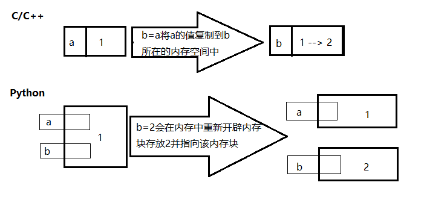
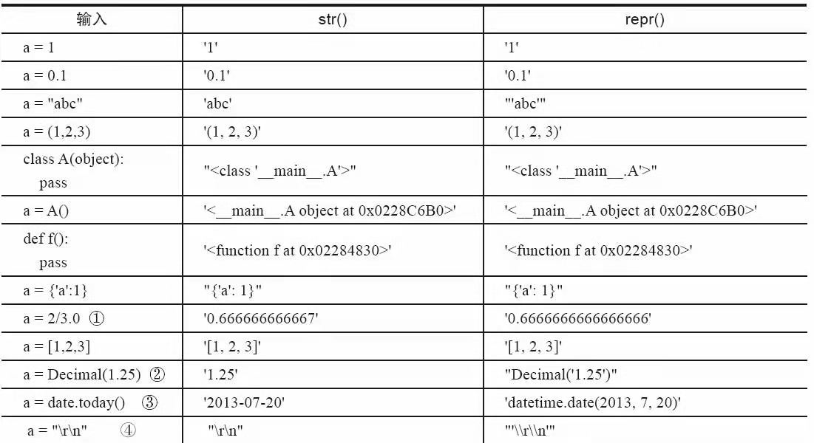

**Rome was not built in one day， coding will not advance vigorously with one effort.**

## 有节制地使用from... import语句

- 尽量优先使用import a形式，如访问B需要使用a.B的形式
- 有节制的使用from a import B， 可以直接访问B
  - 无节制使用可能会导致：命名空间的冲突、循环嵌套导入
- 最好不使用from a import * ，这会导致污染命名空间，且无法清楚得知导入了哪些对象

Python的import机制：在初始化环境的时候会预先加载一批内建模块到内存中，这些模块相关信息被存放在sys.modules中，可以通过sys.modules.items()查看。

加载一个模块时，解释器实际要做以下操作：

1. 在sys.modules中进行搜索看该模块是否已经存在， 如果存在则将其导入到当前局部命名空间，加载结束；
2. 如果在sys.modules中没有找到对应模块的名称，则为需要导入的模块创建一个字典对象，并将该对象信息插入到sys.modules中；
3. 加载前确认是否需要对模块对应的文件进行编译，如果需要则先进行编译；
4. 执行动态加载，在当前模块的命名空间中执行编译后的字节码，并将其中所有的对象放入模块对应的字典中；

```python
# test_module.py
a = 1
b = 'b'
print("this is test_module.py")

# other.py
dir()
# ['__annotations__', '__builtins__', '__cached__', '__doc__', '__file__', '__loader__', '__name__', '__package__', '__spec__']

import sys
import test_module

dir()
# ['__annotations__', '__builtins__', '__cached__', '__doc__', '__file__', '__loader__', '__name__', '__package__', '__spec__', 'sys', 'test_module']
# from test_module import a  # 将 a 加入到sys.module中

assert 'test_module' in sys.modules.keys()

assert id(test_module) == id(sys.modules['test_module'])

dir(test_module)
# ['__builtins__', '__cached__', '__doc__', '__file__', '__loader__', '__name__', '__package__', '__spec__', 'a', 'b']
```

从以上结果看，对于用户定义的模块，import机制会创建一个新的module将其加入到当前的局部命名空间中，与此同时，sys.modules也会加入了该模块的相关信息。

脚本文件所在的目录中的`__pycache__`中多了一个test_module.cpython-36.pyc文件，该文件为解释器生成的模块相对应的字节码，从import之后的输出“this is test_module.py“可以看出模块同时被执行，而a和b被写入test_module所对应的字典信息中。


## 优先使用absolute import

absolute import 可读性和出现问题后可跟踪性更好，而使用relative import可能会导致命名冲突、语义含糊。


##连接字符串优先使用join


## try...except...finally...

无论try中是否有异常抛出，finally语句总会被执行。

try块中发生异常的时候，如果在except语句中找不到对应的异常处理，异常将会被临时保存起来，当finally语句中产生了新的异常、或执行了return、或break语句那么临时保存的异常将被丢失，从而导致异常被屏蔽。

另外不推荐在finally中使用return语句进行返回，这种处理方式不仅会带来误解，可能还会导致严重的错误。

```python
def test_finally(n):
    try:
        if n <= 0:
            raise ValueError('data is negative')
        else:
            return n
    except ValueError as e:
        print(e)
    finally:
        return -1

print(test_finally(0))  # -1
print(test_finally(2))  # -1
```


## 优先使用列表生成式

- 使用列表生成式更为直观清晰、代码更加简洁。
- 列表生成式的效率更高

举例：

```python
words = ['  a', 'awk', 'backup', 'Advance', 'Street']

new_words = []
for word in words:
    if word.strip().istitle():
        new_words.append(word)
print(new_words)

# 列表生成式
new_words2 = [word for word in words if word.strip().istitle()]
print(new_words2)

import random
xlist = [random.randint(0, 10) for i in range(3)]
ylist = [random.randint(-10, 0) for i in range(3)]
point = [(x, y) for x, y in zip(xlist, ylist)]
# [(5, -8), (6, -3), (1, -10)]
```


## 函数传参既不是传值也不是传引用

**Python函数参数传对象，或者说是传对象的引用。**

- 函数参数在传递的过程中将整个对象传入，对**可变对象**的修改在函数内外都可见，调用者和被调用者之间共享这个对象；
- 对于是**不可变对象**的参数，并不能真正被改变，是通过生成一个新对象后赋值来实现改变。我的理解是：一个是实参，一个是形参；

```python
# 两个例子：
# 1、作为不可变对象：参数传值
def test_invarible(var):
    print(var, id(var))
    var += 1
    print(var, id(var))

var = 1
print(var, id(var))
test_invarible(var)
print(var, id(var))
# 1 1380754528
# 1 1380754528
# 2 1380754560
# 1 1380754528
# 如果是引用，函数中var的id应该是不变的，且最后的var打印应该为2。
# var是不可变对象，可以这么理解：外部的var=1是实参，test_invarible入参var是形参，函数中的形参改变了，var重新申请了内存地址，不影响实参

# 2、作为可变对象：参数引用
def test_varibale(varlist):
    print(varlist, id(varlist))
    varlist.append("func")
    print(varlist, id(varlist))

originlist = [1, 2, 3]
test_varibale(originlist)
print(originlist, id(originlist))
# [1, 2, 3] 1486999385800
# [1, 2, 3, 'func'] 1486999385800
# [1, 2, 3, 'func'] 1486999385800
# 如果是传值，且最后的originlist打印应该为最初的[1, 2, 3]。
# originlist是可变对象，函数内外使用同一片内存地址，只要不重新给它分配内存地址，originlist的id是不变的（这里的append是在varlist对象上做的改变，没有重新开辟内存地址）
```

小结：id到底变不变，一看**参数是否为可变对象**，二看**是否重新开辟内存地址**

```python
def function_param(origin_list):
    new_list = origin_list  # new_list和origin_list引用同一个内存地址
    print(origin_list, id(origin_list))
    print(new_list, id(new_list))
    # new_list = [0, 0, 0]  # case1：给new_list重新分配内存地址，id改变
    new_list.append('a')  # case2：在new_list对象上更改，内存地址不变，id不变
    print(new_list, id(new_list))


origin_list = [1, 2, 3]
function_param(origin_list)
print(origin_list, id(origin_list))

'''
new_list = [0, 0, 0]时
[1, 2, 3] 1990045687496
[1, 2, 3] 1990045687496
[0, 0, 0] 1990045619720
[1, 2, 3] 1990045687496
'''
'''
new_list.append('a')时
[1, 2, 3] 2733052026568
[1, 2, 3] 2733052026568
[1, 2, 3, 'a'] 2733052026568
[1, 2, 3, 'a'] 2733052026568
'''
```


 Python中的赋值  VS  C/C++中的赋值：背后的内存地址分配

```
a = 1
b = a
b = 2
```

C/C++：

- 执行`b=a`时，在内存中申请一块内存并将a的值复制到该内存中
- 执行`b=2`时，将b对应的值从原来的1修改为2

Python：

- Python中的赋值不是复制，`b=a`使b与a引用同一个对象，而`b=2`是将b指向对象2

如图所示：



## 警惕默认参数潜在的问题

**可变对象不能作为默认参数传递**

```python
def test_default(paramlist=[]):
    paramlist.append('a')
    return paramlist
  
test_default()
Out[5]: ['a']
test_default.__defaults__
Out[6]: (['a'],)
  
test_default()
Out[7]: ['a', 'a']
test_default.__defaults__
Out[8]: (['a', 'a'],)
```

**def **在Python中是一个可执行的语句，当解释器执行 def 时，默认参数也会被计算，并存在函数的`__defaults__`属性中。

如果 不想让默认参数所指向的对象在所有的函数调用中被共享，而是在函数调用的过程中动态生成，可以在定义时使用None对象作为占位符。

```python
def test_default(paramlist=None):
    if paramlist is None:
        paramlist = []
    paramlist.append('a')
    return paramlist
```


一个问题：假设某个函数需要传入当时系统的时间并做一些处理，下面两种哪种正确？

```python
import time
def test(when = time.time):
    print(when())

def test2(when = time.time()):
    print(when)
'''
我的理解是第一种正确。
第二种在解释器执行def时就计算了when的值，这并不是代码中调用该函数的时间，
更不可能是函数内存某个时刻调用的时间，不符合需求。
'''
```

```python
import time

def test1(when = time.time):
    print(when())

def test2(when = time.time):
    time.sleep(3)  # 加入延时3秒
    print(when())

def test3(when = time.time()):
    print(when)

test1()
test2()
test3()
# 1569592866.623606
# 1569592869.6237614
# 1569592866.623606
# 由结果可知，test2虽然比test3早调用，但是test2的when比test3的大
# 另外，test3和test1的when相等，
# 说明test3函数的when在解释器执行def时就计算了time.time()的值。
```


## 不定长参数的使用

*args 实现可变列表，**kwargs接受字典的关键字参数列表

可变长参数的使用场景：

- 为函数添加一个装饰器

```python
def decorate(func):
    def originfunc(*args, **kwargs):
        print("decorate")
        return func(*args, **kwargs)
    return originfunc

@decorate
def test(var,var2=1):
    print(var)
    print(var2)
```

- 参数的数量不确定，可以考虑使用可变长参数
- 实现函数的多态或者在继承情况下子类需要调用父类的某些方法


## str() 和 repr()的区别

对于不同类型的输入，对比两者的差异：



- 两者的面向的对象不同：str()主要是面向用户，其目的是可读性，返回形式为用户友好性和可读性都较强的字符串类型。而repr()面向的是python解释器、程序员，返回值为Python解释器内部的含义，常作为debug用。
- 在解释器中直接输入a时默认调用repr(）函数，而print(a)是调用str()函数
- repr()返回值一般可以用eval()函数来还原对象：obj == eval(repr(obj))
- 两个方法分别调用内建的`__str__` 、`__repr__`方法，一般来说在类中都应该定义`__repr__`方法，而`__str__`方法是可选的，若没有定义`__str__`方法，默认使用`__repr__`