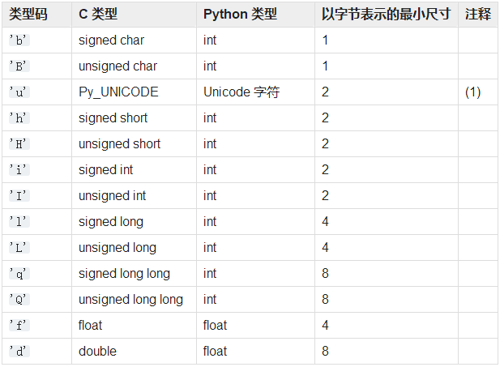
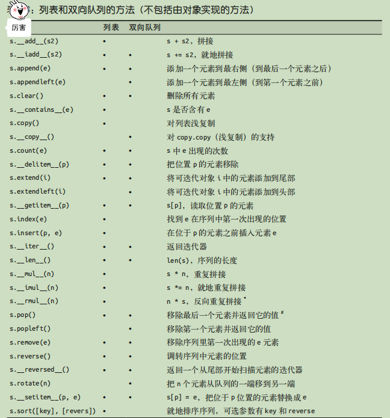

# Python数据模型

**容器序列**和**扁平序列**。有些对象里包含对其他对象的引用，这些对象称为容器。Python 里有是容器但并非序列的类型，比如 dict 和 set。容器序列可以嵌套着使用，因为容器里的引用可以针对包括自身类型在内的任何类型。与此相反，扁平序列因为只能包含原子数据类型，比如整数、浮点数或字符，所以不能嵌套使用。


## Python风格的纸牌

```python
import collections
Card = collections.namedtuple('Card', ['rank', 'suit'])

class FrenchDeck:
    ranks = [str(n) for n in range(2, 11)] + list('JQKA')
    suits = 'spades diamonds clubs hearts'.split()  # 黑桃 方块 梅花 红心

    def __init__(self):
        self._cards = [Card(rank, suit) for suit in self.suits
                       									for rank in self.ranks]
    def __len__(self):
        return len(self._cards)

    def __getitem__(self, position):
        return self._cards[position]


deck = FrenchDeck()
len(deck)				
Out[2]: 52		   # len()的使用是使用 __len__ 函数
deck[0]
Out[3]: CardName(rank='2', suit='spades')
deck[-1]				 # 抽取特定序号的元素，如最后一个deck[-1]，由__getitem__提供
Out[4]: CardName(rank='A', suit='hearts')
```

```python
# 使用Python内置的随机函数random.choice() 获取一张随机牌
from random import choice
choice(deck)
Out[5]: CardName(rank='8', suit='clubs')
choice(deck)
Out[6]: CardName(rank='K', suit='hearts')
```

```python
# 可迭代
for item in deck:
    print(item)
# 反向迭代
for item in deck:
    print(item)

# in 运算符
Card(rank='2', suit='spades') in deck
# Out[7]: True
Card(rank='2', suit='opades') in deck
# Out[8]: False
```

```python
# 排序：先看点数，再比较花色
# 点数：2最小，A最大； 花色：黑桃>红桃>方块>梅花  --> 梅花2最小，为0，黑桃A最大，为52
suit_values =dict(spades=3, hearts=2, diamonds=1, clubs=0)
def spades_high(card):
    rank_value = FrenchDeck.ranks.index(card.rank)   # 考虑到有字母，比较大小用下标
    return rank_value * len(suit_values) + suit_values[card.suit]

for card in sorted(deck,key=spades_high):
    print(card)
```

nametuple 用以构建只有少数属性但是没有方法的对象，比如数据库条目。上面是利用其获取一个纸牌对象。

```python
# 举例：
import collections
Card = collections.namedtuple('CardName', ['rank', 'suit'])
mycard = Card('r1','s1')
mycard
Out[1]: CardName(rank='r1', suit='s1')
```

虽然FrenchDeck隐式地继承了object类，但功能却不是继承而来的。我们通过数据模型和一些合成来实现这些功能。通过实现`__len__`和`__getitem__`这两个特殊方法，FrenchDeck就跟一个Python自有的序列数据类型一样，可以体现出Python的核心语言特性（例如迭代和切片）。同时这个类还可以用于标准库中诸如random.choice、reversed和sorted这些函数。另外，对合成的运用使得`__len__`和`__getitem__`的具体实现可以代理给self._cards这个Python列表（即list对象）。


---

## 字符串表现形式

Python 有一个内置的函数叫 repr，它能把一个对象用字符串的形式表达出来以便辨认，这就是“字符串表示形式”。repr 就是通过 `__repr__` 这个特殊方法来得到一个对象的字符串表示形式的。如果没有实现 `__repr__`，当我们在控制台里打印一个向量的实例时，得到的字符串可能会是`<__main__.Vector at 0x186edbb5eb8>`。

```python
v2 = Vector(1,2)
v2
Out[2]: Vector: 1,2

# 如果没有实现 __repr__
v2 = Vector(1,2)
v2
Out[3]: <__main__.Vector at 0x186edbb5eb8>
```

`__repr__` 和 `__str__` 的区别在于，前者方便我们调试和记录日志，后者是在 str() 函数被使用，或是在用 print 函数打印一个对象的时候才被调用的，并且它返回的字符串对终端用户更友好。

如果只想实现这两个特殊方法中的一个，`__repr__ `是更好的选择，因为如果一个对象没有` __str__ `函数，而 Python 又需要调用它的时候，解释器会用` __repr__ `作为替代。


---

## 特殊方法

```python
from math import hypot

class Vector(object):
    def __init__(self, x=0, y=0):
        self.x = x
        self.y = y

    def __repr__(self):     # 把对象用字符串的形式表达出来
        return f'Vector: {self.x},{self.y}'

    def __add__(self, other):
        x = self.x + other.x
        y = self.y + other.y
        return Vector(x, y)

    def __abs__(self):
        return hypot(self.x, self.y)

    def __bool__(self):
        # return bool(self.__abs__())
        return bool(abs(self))

    # def __bool__(self):
    #     return bool(self.x or self.y)  # 更高效的bool实现方式

    def __mul__(self, scalar):
        return Vector(self.x * scalar, self.y * scalar)

v1 = Vector(1, 2)
v2 = Vector(2, 3)

'''
通过 __add__ 和 __mul__，示例为向量类带来了 + 和 * 这两个算术运算符。
值得注意的是，这两个方法的返回值都是新创建的向量对象，
被操作的两个向量（self 或 other）还是原封不动，代码里只是读取了它们的值而已。
中缀运算符的基本原则就是不改变操作对象，而是产出一个新的值。
'''
```


跟运算符无关的特殊方法:

字符串 / 字节序列表示形式 `__repr__、__str__、__format__、__bytes__ `

数值转换 `__abs__、__bool__、__complex__、__int__、__float__、__hash__、__index__ `

集合模拟 `__len__、__getitem__、__setitem__、__delitem__、__contains__ `

迭代枚举` __iter__、__reversed__、__next__ `

可调用模拟` __call__ `

上下文管理 `__enter__、__exit__ `

实例创建和销毁` __new__、__init__、__del__ `

属性管理` __getattr__、__getattribute__、__setattr__、__delattr__、__dir__ `

属性描述符` __get__、__set__、__delete__ `

跟类相关的服务` __prepare__、__instancecheck__、__subclasscheck__`


跟运算符相关的特殊方法:

一元运算符` __neg__ -、__pos__ +、__abs__ abs() `

众多比较运算符` __lt__ <、 __le__ <=、 __eq__ ==、 __ne__ !=、 __gt__ >、 __ge__ >= `

算术运算符` __add__ +、__sub__ -、__mul__ *、__truediv__  /、__floordiv__ //、__mod__ %、__divmod__ divmod()、__pow__ ** 或 pow()、__round__ round() `

反向算术运算符` __radd__、__rsub__、__rmul__、__rtruediv__、__rfloordiv__、__rmod__、 __rdivmod__、__rpow__ `

增量赋值算术运算符 `__iadd__、__isub__、__imul__、__itruediv__、__ifloordiv__、__imod__、 __ipow__ `

位运算符` __invert__ ~、__lshift__ <<、__rshift__ >>、__and__ &、__or__ |、__xor__ ^ `

反向位运算符` __rlshift__、__rrshift__、__rand__、__rxor__、__ror__ `

增量赋值位运算符` __ilshift__、__irshift__、__iand__、__ixor__、__ior__`


通过实现特殊方法，自定义数据类型可以表现得跟内置类型一样，从而让我们写出更具表达力的代码——或者说，更具 Python 风格的代码。


---

## 列表推导、生成器表达式

```python
symbols = '$¢£¥€¤'
codes = [ord(i) for i in symbols]  # 列表推导式
codes
Out[2]: [36, 162, 163, 165, 8364, 164]	
 
# 列表推导、生成器表达式，有自己的局部作用域，就像函数似的
# 表达式内部的变量和赋值只在局部起作用，表达式的上下文里的同名变量可以被正常应用。
i = 1
codes = [ord(i) for i in symbols]	 
i
Out[3]: 1
  
codes = (ord(i) for i in symbols)
codes
Out[4]: <generator object <genexpr> at 0x00000186EDB45048>
tuple(codes)
Out[5]: (36, 162, 163, 165, 8364, 164)

# 如果生成器表达式是一个函数调用过程中的唯一参数，则不需要额外的括号将表达式包含。
tuple(ord(s) for s in symbols)	
Out[6]: (36, 162, 163, 165, 8364, 164)
# array的构造方法需要两个参数，因此括号是必须的。  
import array
array.array('I', (ord(s) for s in symbols))
Out[7]: array('I', [36, 162, 163, 165, 8364, 164])
```

笛卡尔积：

```python
Xs = [1, 2, 3]
Ys = ['a', 'b']
cartesian_product = [(x, y) for x in Xs for y in Ys ]
cartesian_product
Out[2]: [(1, 'a'), (1, 'b'), (2, 'a'), (2, 'b'), (3, 'a'), (3, 'b')]
  
# 类似于：
for x in Xs:  # 推导式中写前面的，在for循环中相当于在外层
  for y in Ys:
    print((x, y))
```


---

## 切片

如果把切片放在赋值语句的左边，或把它作为 del 操作的对象，我们就可以对序列进行嫁接、切除或就地修改操作。如果赋值的对象是一个切片，那么赋值语句的右侧必须是个可迭代对象。即便只有单独一个值，也要把它转换成可迭代的序列。

```python
l = list(range(10))
l
Out[64]: [0, 1, 2, 3, 4, 5, 6, 7, 8, 9]
  
l[2:5]
Out[65]: [2, 3, 4]
del l[5:7]
l
Out[67]: [0, 1, 2, 3, 4, 7, 8, 9]
  
  
l[3::2] = [11, 22]
Traceback (most recent call last):
  File "D:\Python3.6.0\lib\site-packages\IPython\core\interactiveshell.py", line 2961, in run_code
    exec(code_obj, self.user_global_ns, self.user_ns)
  File "<ipython-input-68-369e6569c21e>", line 1, in <module>
    l[3::2] = [11, 22]
ValueError: attempt to assign sequence of size 2 to extended slice of size 3
l[3::2] = [11, 22, 33]
l
Out[70]: [0, 1, 2, 11, 4, 22, 8, 33]
  
  
l[2:5] = 100
Traceback (most recent call last):
  File "D:\Python3.6.0\lib\site-packages\IPython\core\interactiveshell.py", line 2961, in run_code
    exec(code_obj, self.user_global_ns, self.user_ns)
  File "<ipython-input-71-da8b10461280>", line 1, in <module>
    l[2:5] = 100
TypeError: can only assign an iterable
  
  
l[2:5] = [100]
l
Out[73]: [0, 1, 100, 22, 8, 33]
```

嵌套列表的创建要小心：

如果在 a * n 这个语句中，序列 a 里的元素是对其他可变对象的引用的话，结果可能会出乎意料

```python
board = [['']*3 for i in range(3)]
board
Out[78]: [['', '', ''], ['', '', ''], ['', '', '']]
board[0][1] = 1
board
Out[81]: [['', 1, ''], ['', '', ''], ['', '', '']]

  
board = [['']*3]*3
board
Out[83]: [['', '', ''], ['', '', ''], ['', '', '']]
board[0][1] = 1
board
Out[86]: [['', 1, ''], ['', 1, ''], ['', 1, '']]
```

同理：

```python
board = []
for i in range(3):
    row = ['']*3		# id(row) 地址不同
    board.append(row)
    
board[0][1] = 1
board
Out[96]: [['', 1, ''], ['', '', ''], ['', '', '']]
  

row = ['']*3
board = []
for i in range(3):
    board.append(row)  # 每次循环的是同一个row
    
board
Out[90]: [['', '', ''], ['', '', ''], ['', '', '']]
board[0][1] = 1
board
Out[92]: [['', 1, ''], ['', 1, ''], ['', 1, '']]
```


---

## 序列的增量赋值

增量赋值运算符 += 和 *= 的表现取决于它们的第一个操作对象。

+= 背后的特殊方法是 `__iadd__`（用于“就地加法”）。但是如果一个类没有实现这个方法的 话，Python 会退一步调用 `__add__`。

可变序列一般都实现了 `__iadd__ `方法，因此 += 是就地加法。但是如果 a 没有实现` __iadd__ `的话，a += b 这个表达式的效果就变得跟 a = a + b 一样了：首先 计算 a + b，得到一个新的对象，然后赋值给 a。也就是说，在这个表达式中，变量名会不会被关联到新的对象，完全取决于这个类型有没有实现 `__iadd__` 这个方法。

```python
li = [1,2,3]
id(li)
Out[2]: 1679025343496
li *= 2
li
Out[3]: [1, 2, 3, 1, 2, 3]
id(li)
Out[4]: 1679025343496

tu = (1,2,3)
id(tu)
Out[5]: 1679025314120
tu *= 2
tu
Out[6]: (1, 2, 3, 1, 2, 3)
id(tu)
Out[7]: 1679025046824
```

对不可变序列进行重复拼接操作的话，效率会很低，因为每次都有一个新对象，而解释器需要把对象中的元素先复制到新的对象里，然后再追加新的元素。

---

## 关于 += 的谜题

```python
tul = (1,2,[1,2])
tul[2] += [3,4]
Traceback (most recent call last):
  File "D:\Python3.6.0\lib\site-packages\IPython\core\interactiveshell.py", line 2961, in run_code
    exec(code_obj, self.user_global_ns, self.user_ns)
  File "<ipython-input-115-3108c6568ca3>", line 1, in <module>
    tul[2] += [3,4]
TypeError: 'tuple' object does not support item assignment
tul
Out[116]: (1, 2, [1, 2, 3, 4])
```

```python
import dis
dis.dis('tul[2] += [3,4]')
  1           0 LOAD_NAME                0 (tul)
              2 LOAD_CONST               0 (2)
              4 DUP_TOP_TWO
              6 BINARY_SUBSCR
              8 LOAD_CONST               1 (3)
             10 LOAD_CONST               2 (4)
             12 BUILD_LIST               2
             14 INPLACE_ADD
             16 ROT_THREE
             18 STORE_SUBSCR
             20 LOAD_CONST               3 (None)
             22 RETURN_VALUE
```

教训：

- 不要把可变对象放在元组（不可变对象）中。
- 增量赋值不是一个原子操作。以上例子虽然抛出异常，但是完成了操作。
- 查看Python字节码有助于了解代码背后的运行机制。

---

## 数组

#### array

如果我们需要一个只包含数字的列表，那么 array.array 比 list 更高效。数组支持所有跟可变序列有关的操作，包括 .pop、.insert 和 .extend。另外，数组还提供从文件读取和存入文件的更快的方法，如 .frombytes 和 .tofile。

Python 数组跟 C 语言数组一样精简。创建数组需要一个类型码，这个类型码用来表示在 底层的 C 语言应该存放怎样的数据类型。比如 b 类型码代表的是有符号的字符（signed  char），因此 array('b') 创建出的数组就只能存放一个字节大小的整数，范围从 -128 到 127，这样在序列很大的时候，我们能节省很多空间。而且 Python 不会允许你在数组里存 放除指定类型之外的数据。

```python
from array import array
from random import random

floats_array = array('d', (random() for i in range(10 ** 7)))  # 双精度浮点数组，类型码:d
print(floats_array[0])

f = open('floats.bin', 'wb')
floats_array.tofile(f)  # 把数组存入一个二进制文件中
f.close()

floats_array2 = array('d')  # 新建一个双精度浮点空数组
f = open('floats.bin', 'rb')  
floats_array2.fromfile(f, 10 ** 7)  # 把10**7个浮点数从二进制文件中读取出来
f.close()
print(floats_array2[0])
print(floats_array == floats_array2)  # 检查两个数组是否相同
```

 array模块定义了一种对象类型，可以紧凑地表示基本类型值的数组：字符、整数、浮点数等。 数组属于序列类型，其行为与列表非常相似，不同之处在于其中存储的对象类型是受限的。 类型在对象创建时使用单个字符的 *类型码*来指定。 已定义的类型码如下： 




#### NumPy 以后再学


---

## 双向队列及其他

利用 .append 和 .pop 方法，我们可以把列表当作栈或者队列来用（比如，把 .append 和 .pop(0) 合起来用，就能模拟栈的“先进先出”的特点）。但是删除列表的第一个元素（抑或是在第一个元素之前添加一个元素）之类的操作是很耗时的，因为这些操作会牵扯到移动列表里的所有元素。

双向队列实现了大部分列表所拥有的方法，也有一些额外的符合自身设计的方法，比如说 popleft 和 rotate。但是为了实现这些方法，双向队列也付出了一些代价，从队列中间删除元素的操作会慢一些，因为它只对在头尾的操作进行了优化。

append 和 popleft 都是原子操作，也就说是 deque 可以在多线程程序中安全地当作先进先出的栈使用，而使用者不需要担心资源锁的问题。

collections.deque 类（双向队列）是一个线程安全、可以快速从两端添加或者删除元素的 数据类型。而且如果想要有一种数据类型来存放“最近用到的几个元素”，deque 也是一个很好的选择。这是因为在新建一个双向队列的时候，你可以指定这个队列的大小，如果这个队列满员了，还可以从反向端删除过期的元素，然后在尾端添加新的元素。

```python
from collections import deque

# maxlen是一个可选参数，表示可容纳元素的数量，一旦设定不能修改
dq = deque(range(10), maxlen=10) 
dq
Out[4]: deque([0, 1, 2, 3, 4, 5, 6, 7, 8, 9])

# 队列的旋转操作接受一个参数 n，当 n > 0 时，队列的最右边的 n 个元素会被移动到队列的左边。
# 当 n < 0 时，最左边的 n 个元素会被移动到右边。
dq.rotate(3)
dq
Out[6]: deque([7, 8, 9, 0, 1, 2, 3, 4, 5, 6])
dq.rotate(-3)
dq
Out[8]: deque([0, 1, 2, 3, 4, 5, 6, 7, 8, 9])
  
dq.appendleft(-1)
dq
Out[10]: deque([-1, 0, 1, 2, 3, 4, 5, 6, 7, 8])
dq.append(-2)
dq
Out[12]: deque([0, 1, 2, 3, 4, 5, 6, 7, 8, -2])

# 当试图对一个已满（len(d) == d.maxlen）的队列做尾部添加操作的时候，它头部的元素会被删除掉。
dq.extend([11,22])
dq
Out[14]: deque([2, 3, 4, 5, 6, 7, 8, -2, 11, 22])
# 在队列做头部添加操作的时候，它尾部的元素会被删除掉。
dq.extendleft([-11,-22])
dq
Out[16]: deque([-22, -11, 2, 3, 4, 5, 6, 7, 8, -2])
```

列表和双向队列的方法（不包括由对象实现的方法）:




除了 deque 之外，还有些其他的 Python 标准库也有对队列的实现：

**queue** 

提供了同步（线程安全）类 Queue、LifoQueue 和 PriorityQueue，不同的线程可以利用 这些数据类型来交换信息。这三个类的构造方法都有一个可选参数 maxsize，它接收正整数作为输入值，用来限定队列的大小。但是在满员的时候，这些类不会扔掉旧的元素来腾出位置。相反，如果队列满了，它就会被锁住，直到另外的线程移除了某个元素而腾出了位置。这一特性让这些类很适合用来控制活跃线程的数量。 

**multiprocessing** 

这个包实现了自己的 Queue，它跟 queue.Queue 类似，是设计给进程间通信用的。同时 还有一个专门的 multiprocessing.JoinableQueue 类型，可以让任务管理变得更方便。 

**asyncio** 

Python 3.4 新提供的包，里面有 Queue、LifoQueue、PriorityQueue 和 JoinableQueue，这些类受到 queue 和 multiprocessing 模块的影响，但是为异步编程里的任务管理提供了专门的便利。 

**heapq** 

跟上面三个模块不同的是，heapq 没有队列类，而是提供了 heappush 和 heappop 方法，让用户可以把可变序列当作**堆**队列或者优先队列来使用。