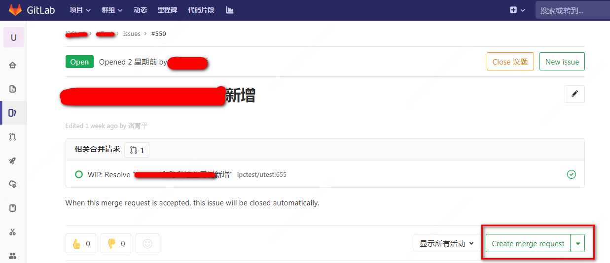
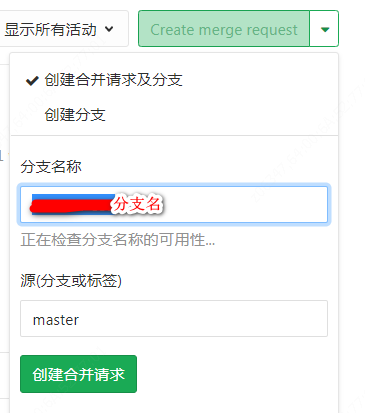

## 当前开发分支 merge 主线代码

工作协作开发某个模块或者功能特性时，一般都是从主线master创建分支，然后将该分支拉取到本地进行开发，该模块开发完成后，再将此分支合并到远程主分支。如果是特殊分支可以保留成一条单独的分支（不合入主线）来维护。

但是我们经常会遇到一些问题，比如我们都是整个团队协作开发，等到编码完成、review结束，需要将该分支合并到远程分支的时候，远程分支（不可避免地有其他同事对其有代码提交）已经有很多次提交（commit)了，自己的分支已经落后主分支很多版本，切换回主分支的时候就不在最新commit上，即没有最新的代码。

如果是自己编码的分支提交上去和主线没有冲突还好，直接合入主线就行，若有冲突就本地处理本分支的冲突再合入；但如果编码周期长，需要经常更新主线代码，拉取同事最近提交到主线的代码，那么必须将主线最新代码合入我现在开发的分支中。

下面结合Gitlab，在此基础上小结一下：

对于一个具体的开发任务

#### 1. 创建议题

一般先创建一个议题（Issue）：

#### 2.创建合并请求

再创建一个合并请求（Create merge request），分支名可以自己修改，如 test_dev

#### 3. 本地检出分支

然后在本地拉取远程最新的(刚刚创建的)分支, 并检出该分支：

`git fetch origin`
`git checkout -b test_dev  origin/test_dev`

#### 4.编码 & review

接下来就可以在本地的该分支上编码了。编码完成后，提交到该分支，review后再将该分支合并到远程主分支。

#### 5. merge 主线

中间可能存在的问题，在合并到远程分支时，比如这里的test_dev已经落后主分支很多次提交了，为了避免合不进去，需要先解决冲突等。在开发过程中经常将主线master（test_dev拉取的源分支，即假设test_dev是从master分支上拉下来的）最新代码合入当前的分支 test_dev。

1. 查看当前分支：`git branch` ，确保当前处于开发的分支上
2. 查看本地是否有test_dev分支的源分支：`git branch`，如果本地有主线，则先切换到主线分支：`git checkout master`，再更新本地的主线代码: `git pull` ；
3. 如果本地没有test_dev的源分支，就拉取远程库中所有的分支：`git fetch origin`，然后检出主线代码： `git checkout master` ；
4. 前两步使得主线代码是最新，然后切换到原来我们开发的分支上：`git checkout test_dev`，最后将 master 主线代码 合入test_dev分支： `git merge master` ；
5. 如果有冲突就在本地处理，处理完后，此时的该分支已经不落后源分支master了；
6. 将开发的代码提交到 test_dev ： `git add .`，`git commit -m xxx`，`git push` ；
7. review后流程结束后，将test_dev分支合入源分支，若没有留该分支的必要就删除该test_dev分支。